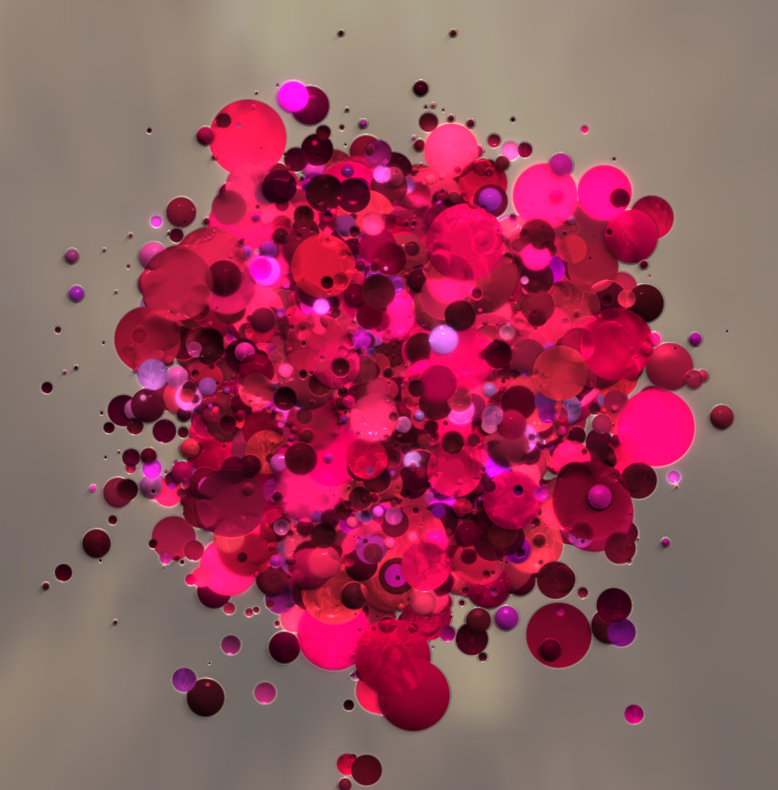

# dplug 

dplug is a library for creating audio plugins.
Additionally it comes with music DSP algorithms that might be useful for your next-generation MS converter plugin.
**Currently support VST 2.x plugins on Windows and Mac OS X, 32-bit and 64-bit.**

## Tutorial

https://auburnsounds.com/blog/2016-02-08_Making-a-Windows-VST-plugin-with-D.html

## Contents

### dplug:client
  * Abstract plugin client interface. Currently implemented once for VST.

### dplug:host
  * Abstract plugin host interface.

### dplug:vst
  * VST SDK D bindings
  * VST plugin client

### dplug:au
  * Audio Unit plugin client (WIP)

### dplug:window
   * implements windowing for Win32, Cocoa and Carbon

### dplug:gui
   * Needed for plugins that do have an UI
   * Toolkit includes common widgets (knob/slider/switch/logo/label)
   * PBR-based renderer for a fully procedural UI (updates are lazy and parallel)

### dplug:dsp
  * Basic support for audio processing:
    - FFT and windowing functions (include STFT with tunable overlap and zero-phase windowing)
    - FIR and RJB biquads (no higher order IIR sorry)
    - mipmapped wavetables for antialiased oscillators
    - noise generation including white/pink/demo noise
    - various kinds of smoothers and envelopes
    - delay-line and interpolation

### Examples
   * `examples/distort`: mandatory distortion plugin
   * `examples/ms-encode`: simplest plugin for tutorial purpose
   * `examples/time_stretch`: resampling x2 through FFT zero-padding

### Tools
   * `tools/pbr-sketch`: workspace for creating plugin background textures
   * `tools/release`: DUB frontend to build Mac bundles and use LDC with proper envvars
   * `tools/process`: test plugin host for testing audio processing speed/reproducibility, in D
   * `tools/wav-compare`: comparison of WAV files
   * `tools/lift-gamma-gain`: tool to adjust color correction curves on a "finished" UI

## How to build plugins

- Use the DMD >= 2.067 compiler or the LDC >= 1.0.0
- Install DUB, the D package manager: http://code.dlang.org/download
- Compiling for Mac or with LDC? Clone and build DUB master: https://github.com/D-Programming-Language/dub for correct flags
- go in the `examples/distort` directory
- type `dub --compiler=dmd` or `dub --compiler=ldc2` depending on the platform

## Licenses

dplug has three different licenses depending on the part you need.
For an audio plugin, you would typically need all three.
I recommend that you check individual source files for license information.

### Plugin format wrapping

Plugin wrapping is heavily inspired by the WDL library (best represented here: https://github.com/olilarkin/wdl-ol).

Some files falls under the Cockos WDL license.

Important contributors to WDL include:
- Cockos: http://www.cockos.com/
- Oliver Larkin: http://www.olilarkin.co.uk/

However dplug is **far** from a translation of WDL:

Pros:
- no plugin-wide mutex lock. All locks are of a short duration.
- plugin parameters implement the Observer pattern
- no need to use Xcode whatsoever
- float parameters can have user-defined mapping
- PBR-style rendering lets you have a good visual quality with less disk space, at the cost of more work
- no need to deal with resource compilers: D can `import("filename.ext")` them.

Cons:
- less battle-tested in general
- hipster compilers are used
- API may change without notice (pin the version of dplug you use)
- AU, AAX and VST3 unimplemented
- no resizeable UI
- no HDPI support

### VST SDK translation

This sub-package falls under the Steinberg VST license.

VST is a trademark of Steinberg Media Technologies GmbH.
Please register the SDK via the 3rd party developper license on Steinberg site.

Before you make VST plugins with dplug, you need to read and agree with the license for the VST3 SDK by Steinberg.
If you don't agree with the license, don't make plugins with dplug.
Find the VST3 SDK there: http://www.steinberg.net/en/company/developers.html

### Misc

Other source files fall under the Boost 1.0 license.

### FAQ

- What is the minimum Windows version supported?

Windows XP+

- What is the minimum OSX version supported?

Mac OS X 10.7+
Probably possible to go below in cases, but impractical. To try that modify the "release" tool.

- What D compiler can possibly be used?

   See `.travis.yml` for supported compilers.

- Is dplug stable?

No. The interface tend to change for improvements.
Pin the version you use using DUB version specifications.

### Release notes

- v2.x.y:
  * this is the next release, and API will break without notice
  * supports VST for 32-bit and 64-bit, Windows and Mac
  * `release` tool now expects a VST or AU configuration, see the `distort` example for details
  * special `dub.json` key `CFBundleIdentifier` became `CFBundleIdentifierPrefix`, see how `distort` works to update your plugins dub.json
  * 10.6 compatibility dropped.

- v1.x.y:
  * initial release, VST support for 32-bit and 64-bit, Windows and Mac