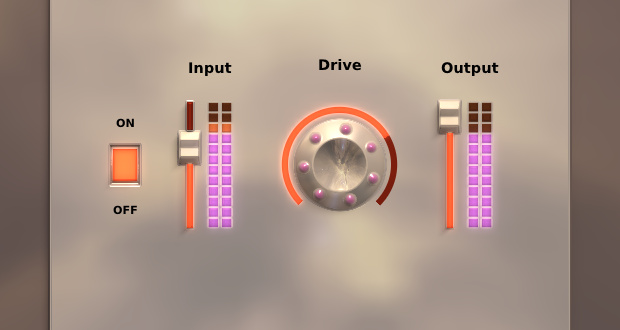

# dplug 

dplug is a library for creating audio plugins.
Additionally it comes with music DSP algorithms that might be useful for your next-generation MS converter plugin.
**Currently support VST 2.x plugins on Windows and Mac OS X, 32-bit and 64-bit.**

## Contents

### dplug:plugin
  * Abstract plugin client interface. Currently implemented once for VST.

### dplug:vst
  * VST SDK D bindings
  * VST plugin client

### dplug:window
   * implements windowing for Win32, Cocoa, Carbon and X11

### dplug:gui
   * Needed for plugins that do have an UI
   * Toolkit includes common widgets (knob/slider/switch/logo/label)
   * PBR-based renderer for a fully procedural UI (updates are lazy and parallel)

### dplug:dsp
  * Basic support for audio processing:
    - FFT and windowing functions (include STFT with tunable overlap and zero-phase windowing)
    - FIR and RJB biquads (no higher order IIR sorry)
    - mipmapped wavetables for antialiased oscillators
    - noise generation including white/pink/demo noise
    - various kinds of smoothers and envelopes
    - delay-line and interpolation

### Examples
   * `examples/distort`: mandatory distortion plugin
   * `examples/time_stretch`: resampling x2 through FFT zero-padding
   * `examples/just_windowing`: test program for the windowing sub-package
   * `examples/materials`: generate pretty images

### Tools
   * `tools/pbr-sketch`: workspace for creating plugin background textures
   * `tools/release`: DUB frontend to build Mac bundles and use LDC with proper envvars
   * `tools/ldvst`: test VST host, in D
   * `tools/ldvst-cpp`: test VST host, in C++

## How to build plugins

- Use the DMD compiler on Windows or the LDC compiler on Mac: http://dlang.org/download.html
- Install DUB, the D package manager: http://code.dlang.org/download
- go in the `examples/distort` directory
- type `dub --compiler=dmd` or `dub --compiler=ldc2` depending on the platform

## Licenses

dplug has three different licenses depending on the part you need.
For an audio plugin, you would typically need all three.
I recommend that you check individual source files for license information.

### Plugin format wrapping

Plugin wrapping is heavily inspired by the WDL library (best represented here: https://github.com/olilarkin/wdl-ol).

Some files falls under the Cockos WDL license.

Important contributors to WDL include:
- Cockos: http://www.cockos.com/
- Oliver Larkin: http://www.olilarkin.co.uk/

However dplug is **far** from a translation of WDL:

Pros:
- there is no plugin-wide mutex lock. All locks are of a short duration.
- plugin parameters implement the Observer pattern
- no need to use Xcode whatsoever
- float parameters can have user-defined mapping

Cons:
- much less tested in general
- hipster compilers are used
- API may change without notice (pin the version of dplug you use)
- AU, AAX and VST3 unimplemented

### VST SDK translation

This sub-package falls under the Steinberg VST license.

VST is a trademark of Steinberg Media Technologies GmbH.
Please register the SDK via the 3rd party developper license on Steinberg site.

Before you make VST plugins with dplug, you need to read and agree with the license for the VST3 SDK by Steinberg.
If you don't agree with the license, don't make plugins with dplug.
Find the VST3 SDK there: http://www.steinberg.net/en/company/developers.html

### Misc

Other source files fall under the Boost 1.0 license.

